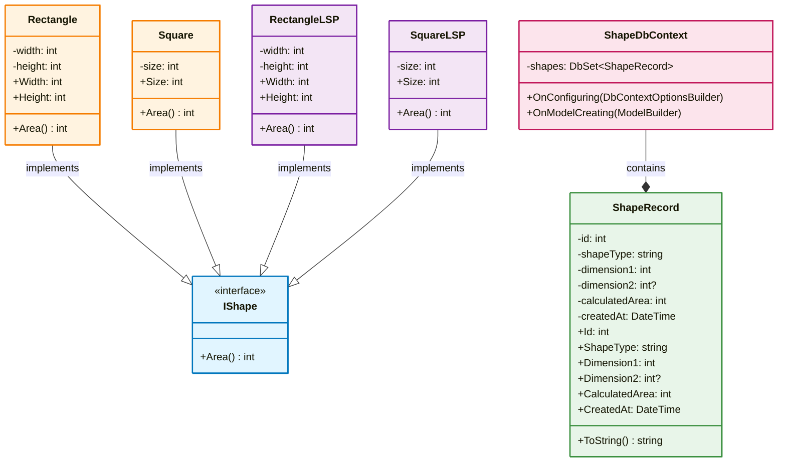

# Lab22 - Class Diagram (Liskov Substitution Principle)

## Діаграма класів



## 📋 Легенда

| Клас | Опис |
|------|------|
| **IShape** | Інтерфейс, який визначає контракт для всіх фігур |
| **Rectangle** | Прямокутник (помилкова реалізація) |
| **Square** | Квадрат - успадковується від Rectangle ❌ |
| **RectangleLSP** | Прямокутник - реалізує IShape ✅ |
| **SquareLSP** | Квадрат - реалізує IShape ✅ |
| **ShapeRecord** | Модель даних для БД |
| **ShapeDbContext** | Entity Framework контекст |

## ✅ Правильна реалізація (LSP)

```
RectangleLSP ─→ IShape
SquareLSP ────→ IShape
```

- Обидва класи реалізують IShape окремо
- Можна використовувати як IShape без проблем
- Немає спадкування між ними

## ❌ Помилкова реалізація

```
Rectangle ─→ IShape
Square ────→ Rectangle  ← ПОМИЛКА! Порушує LSP
```

- Square успадковується від Rectangle
- Має інші властивості (Size замість Width/Height)
- Код очікує Rectangle, але отримує Square

## 🗄️ База даних (SQLite)

**Файл:** `shapes.db`

**Таблиця:** `Shapes`

```
ShapeRecord {
  Id: int (Primary Key)
  ShapeType: string ("Rectangle" | "Square")
  Dimension1: int (Width або Size)
  Dimension2: int? (Height, тільки для Rectangle)
  CalculatedArea: int
  CreatedAt: DateTime
}
```

## 📂 Структура проекту

```
Lab22/
├── lab22/
│   ├── Program.cs
│   ├── Shapes/
│   │   ├── IShape.cs
│   │   ├── Rectangle.cs
│   │   ├── Square.cs
│   │   ├── RectangleLSP.cs
│   │   └── SquareLSP.cs
│   ├── Models/
│   │   └── ShapeRecord.cs
│   ├── Data/
│   │   └── ShapeDbContext.cs
│   └── lab22.csproj
├── class-diagram.html
├── diagram.html
└── diagram.md
```

## 🚀 Як запустити

```bash
cd Lab22/lab22
dotnet run
```

**Результат:**
- Обчислює площі фігур
- Зберігає в базу даних SQLite
- Виводить дані з БД

## 🔗 Зв'язки в БД

Кожна фігура зберігається як `ShapeRecord`:
- Rectangle (5, 10) → Area = 50
- Square (7) → Area = 49

**Всього фігур:** 2
**Сумарна площа:** 99
