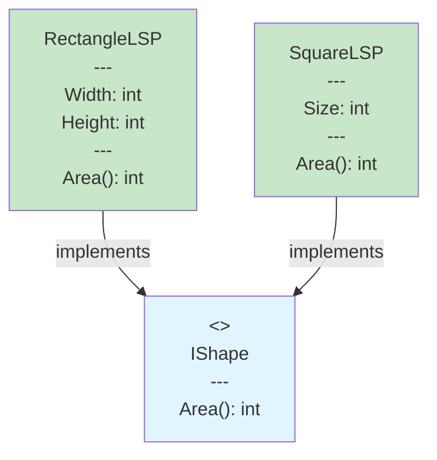

# LSP - Liskov Substitution Principle



## ✅ Правильна реалізація LSP

- **RectangleLSP** реалізує **IShape**
- **SquareLSP** реалізує **IShape** (НЕ наслідує Rectangle)
- Обидві класи можна використовувати як `IShape` без проблем

## ❌ Помилкова реалізація (була раніше)

```
Square : Rectangle  // ❌ Порушує LSP!
```

**Чому це помилка?**
- Square має інші властивості (Size замість Width/Height)
- Код, що очікує Rectangle, може порушитися при використанні Square
